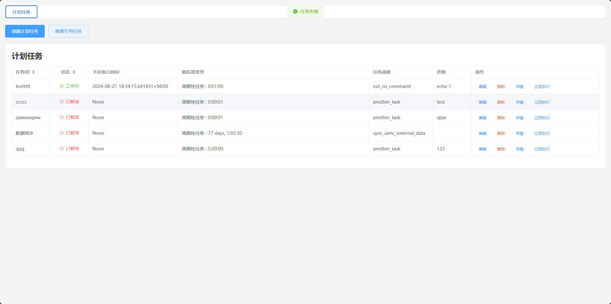
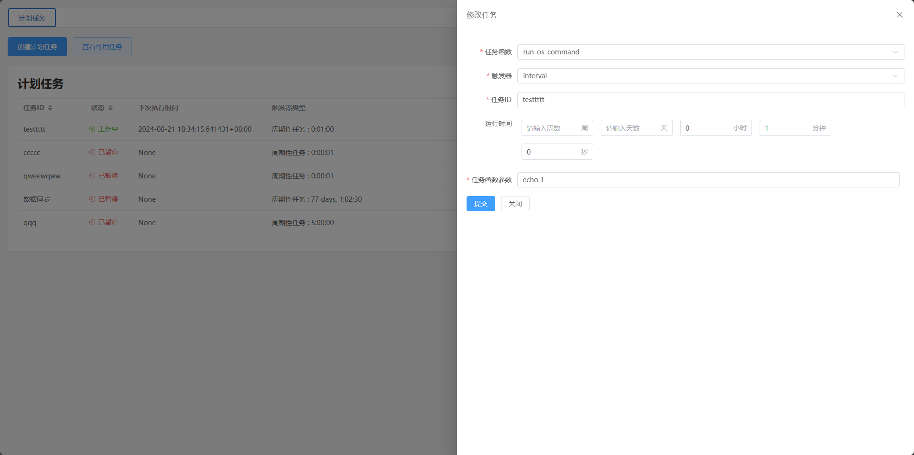
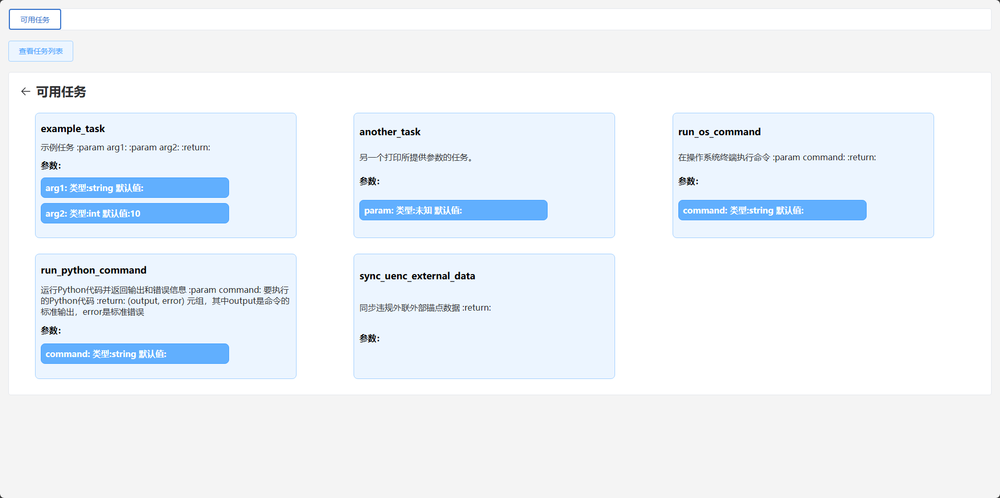
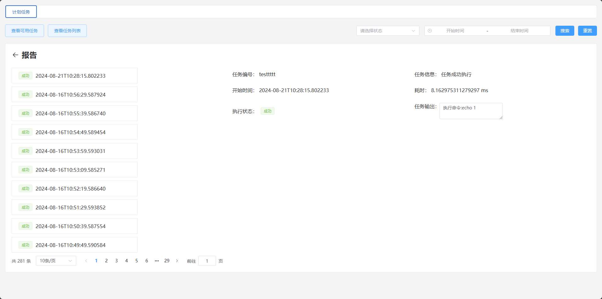

# 可视化定时任务管理

一键启动🚀

使用init.sql初始化表

```
python3 main.py
```

基于 Python🐍 Scheduler📅 和 Fastapi⚡框架实现

- 🎨可视化界面操作

- ⏱️定时任务统一管理

- 💥支持秒级定时任务

- 🔍任务可搜索、⏸️暂停、✏️编辑、❌删除

- 💡动态解析任务函数和参数

- 📊任务状态实时展示


支持三种定时任务类型👐

- 🌾cron 指定定期执行

- 🕒interval 间隔时间执行

- 📅date 特定时间执行









