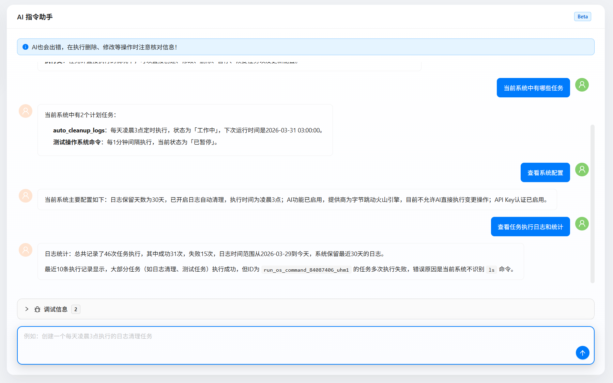
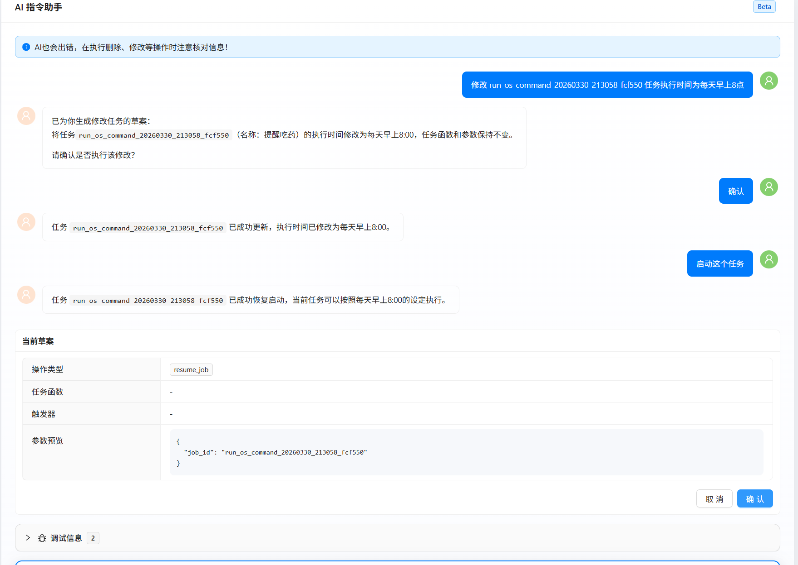
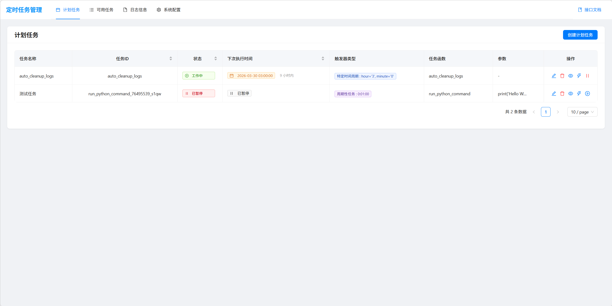
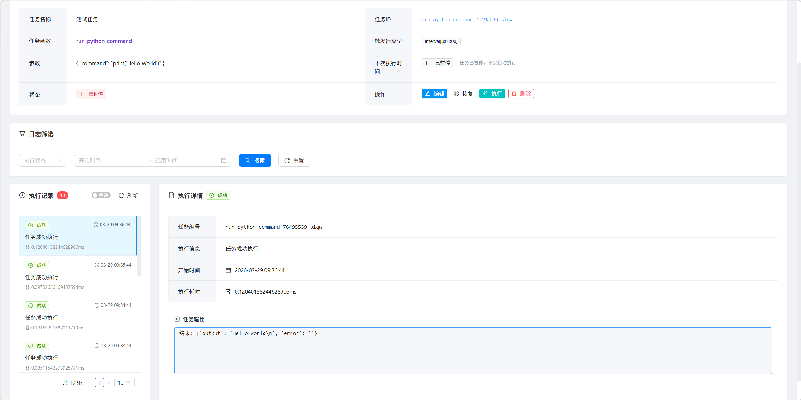
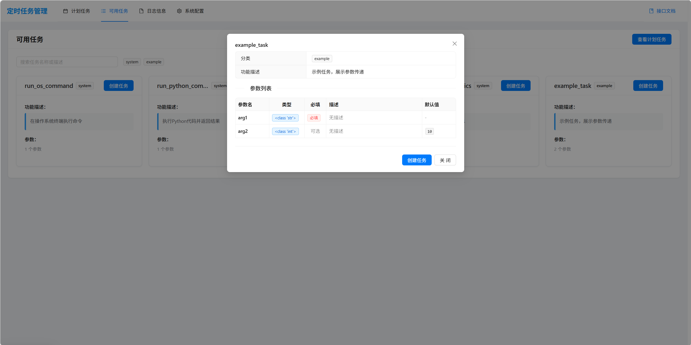
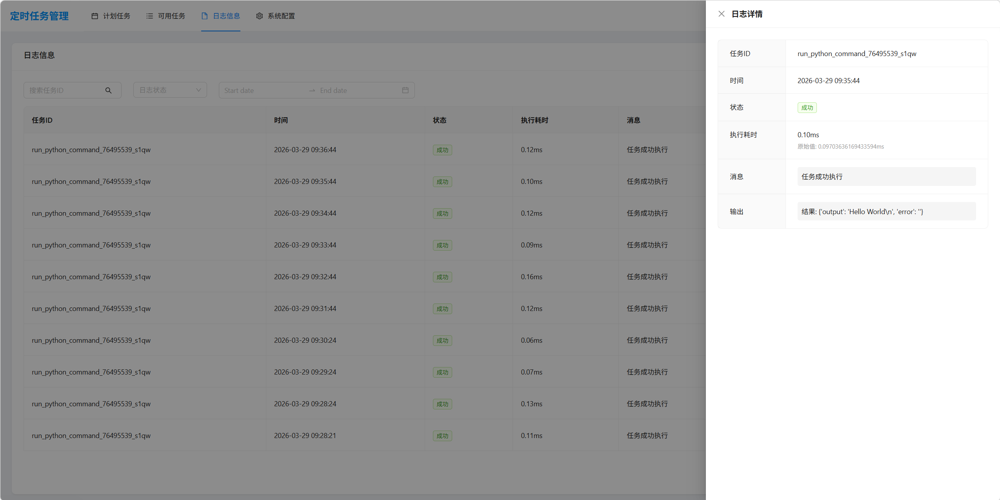

# FAVS (FastAPI APScheduler Visual System) 

> 基于 Python FastAPI + APScheduler + AI 构建的智能可视化定时任务管理平台

[](https://www.python.org/)
[](https://fastapi.tiangolo.com/)
[](https://apscheduler.readthedocs.io/)
[](./docker-compose.yml)
[](./LICENSE)


此仓库仅包含后端代码，更多项目截图及前端代码移步至 [前端代码仓库](https://github.com/mocehu/aps_dev_frontend)








## 功能特性

- 可视化界面操作，无需命令行、黑窗口
- 三种定时任务类型：cron、interval、date
- 支持秒级定时任务
- 任务搜索、暂停、编辑、删除
- 动态解析任务函数和参数
- 任务状态实时展示
- 执行日志追踪与查询
- AI - 自然语言操作（支持 OpenAI 兼容接口）
- AI - 代码生成与审查
- 自定义任务函数（前端直接编写代码，安全沙箱执行）
- 任务模块热加载
- 多数据库支持（PostgreSQL / SQLite）
- Docker / docker-compose 一键部署

## 技术栈

| 组件 | 技术 |
|------|------|
| Web框架 | FastAPI |
| 任务调度 | APScheduler |
| 数据库 | PostgreSQL / SQLite |
| ORM | SQLAlchemy |
| 数据库迁移 | Alembic |
| 缓存 | Redis |

## 快速开始

### 环境要求

- Python 3.11+
- PostgreSQL 15+ (可选，默认使用 SQLite)
- Redis 7+ (可选)

（本项目未依赖底层或特殊功能，版本要求仅供参考，可适当当降低版本）

### 本地开发

1. **克隆项目**
```bash
git clone https://github.com/mocehu/fastapi-apscheduler-visual.git
cd fastapi-apscheduler-visual
```

2. **安装依赖**
```bash
pip install -r requirements.txt
```

3. **配置环境变量**
```bash
cp .env.example .env
# 编辑 .env 文件，根据需要修改配置
```

4. **启动服务**
```bash
python -m app.main
# 或
uvicorn app.main:app --reload
```

> 数据库会在首次启动时自动初始化，无需手动操作。

服务启动后访问：
- API文档: http://localhost:8000/docs
- ReDoc文档: http://localhost:8000/redoc

### Docker 部署

一键启动（包含 PostgreSQL 和 Redis）：

```bash
docker-compose up -d
```

仅启动应用（使用 SQLite）：

```bash
docker build -t scheduler-app .
docker run -d -p 8000:8000 scheduler-app
```

## 配置说明

### 环境变量

| 变量 | 说明 | 默认值 |
|------|------|--------|
| `DB_TYPE` | 数据库类型 (sqlite/postgresql) | sqlite |
| `POSTGRES_HOST` | PostgreSQL 主机 | localhost |
| `POSTGRES_PORT` | PostgreSQL 端口 | 5432 |
| `POSTGRES_USER` | PostgreSQL 用户名 | postgres |
| `POSTGRES_PASSWORD` | PostgreSQL 密码 | - |
| `POSTGRES_DB` | PostgreSQL 数据库名 | aps_dev |
| `REDIS_HOST` | Redis 主机 | localhost |
| `REDIS_PORT` | Redis 端口 | 6379 |
| `REDIS_PASSWORD` | Redis 密码 | - |
| `REDIS_DB` | Redis 数据库编号 | 0 |
| `HOST` | 服务监听地址 | 0.0.0.0 |
| `PORT` | 服务监听端口 | 8000 |
| `GITHUB_REPO` | GitHub 仓库地址 (格式: owner/repo) | - |
| `API_KEY_ENABLED` | 是否启用 API Key 认证 | true |
| `API_KEY` | API 密钥 | - |
| `AI_ENABLED` | 是否启用 AI 功能 | true |
| `AI_PROVIDER` | AI 提供商 | openai_compatible |
| `AI_BASE_URL` | AI 接口地址 | https://api.openai.com/v1 |
| `AI_API_KEY` | AI API 密钥 | - |
| `AI_MODEL` | 默认 AI 模型 | gpt-4o-mini |
| `AI_ALLOW_EXECUTE` | 是否允许 AI 直接执行变更 | false |
| `AI_STREAM_ENABLED` | 是否启用 AI 流式输出 | true |
| `AI_AGENT_API_KEY` | 外部 AI Agent 专用密钥 | - |
| `AI_MAX_HISTORY_MESSAGES` | AI 上下文最大历史消息数 | 12 |

> 日志清理相关配置现已支持前端动态配置，通过 API 接口管理，详见接口文档

## API 安全

### API Key 认证

系统默认启用 API Key 认证，所有 API 请求需携带正确的 `X-API-Key` 请求头。

**配置：**

```env
# .env
API_KEY_ENABLED=true
API_KEY=your-secret-key-here
```

**公开接口（无需认证）：**

| 接口 | 说明 |
|------|------|
| `/docs` | Swagger 文档 |
| `/redoc` | ReDoc 文档 |
| `/health` | 健康检查 |

**动态配置：**

支持通过系统配置接口动态控制：

| 配置键 | 说明 | 默认值 |
|--------|------|--------|
| `api_key_enabled` | 是否启用 API Key 认证 | `true` |
| `api_key` | API 密钥（为空时使用环境变量） | 空 |

> 环境变量 `API_KEY_ENABLED=false` 时，动态配置无效。

**生成安全密钥：**

```bash
openssl rand -hex 32
```

## 数据库管理

### 自动初始化

应用启动时会自动创建所需的数据库表，首次启动无需手动操作。

### 手动管理（可选）

手动初始化脚本用于特殊场景：

```bash
# 查看表状态
python scripts/init_db.py --status

# 重置数据库（危险操作，会删除所有数据）
python scripts/init_db.py --reset
```

### 数据库迁移

使用 Alembic 进行数据库版本管理：

```bash
# 创建迁移脚本
alembic revision --autogenerate -m "description"

# 应用迁移
alembic upgrade head

# 回退迁移
alembic downgrade -1
```

## AI 远程指令

系统支持通过 OpenAI 兼容接口接入 AI，实现远程自然语言操作计划任务。

### 功能说明

- 支持其他电脑、手机、脚本或外部 agent 直接调用 AI 接口
- 支持多轮会话，历史记录存储到数据库
- 支持 function calling，将任务系统能力暴露为结构化工具
- 默认使用草案模式，生成任务增删改建议而不是直接执行

### AI 配置

建议同时配置以下环境变量或系统配置项：

```env
AI_ENABLED=true
AI_PROVIDER=openai_compatible
AI_BASE_URL=https://api.openai.com/v1
AI_API_KEY=your-llm-api-key
AI_MODEL=gpt-4o-mini
AI_ALLOW_EXECUTE=false
AI_STREAM_ENABLED=true
AI_MAX_HISTORY_MESSAGES=12
```

### AI 工具能力

**查询类（直接执行）：**
- 查询全部任务、单个任务详情、搜索任务
- 查询可用任务函数和分类
- 查询任务执行日志和统计
- 查询系统配置、获取当前时间

**草案类（生成草案，需用户确认后执行）：**
- 生成创建/修改/删除/暂停/恢复任务草案
- 生成配置修改草案

**执行类（需 ai_allow_execute=true 才可用）：**
- 直接创建/修改/删除/暂停/恢复任务
- 直接更新配置

### 安全说明

- AI 接口支持两种认证方式：
  - 普通 API Key：可访问所有接口
  - Agent API Key：仅可访问 `/ai/*` 接口，适合外部 agent 调用
- 配置 `AI_AGENT_API_KEY` 后，外部 agent 可使用该密钥调用 AI 接口
- 默认不允许 AI 直接执行任务变更
- 高风险任务函数（如系统命令执行）不建议暴露给 AI
- 所有 AI 会话、消息、工具调用会记录到数据库

> API 详细说明见 [API 文档](docs/API.md)

## 日志管理

### 自动清理

系统会根据配置自动清理过期日志：
- 删除超过保留天数的日志
- 当日志总数超过最大限制时删除最旧的日志

> 清理策略可通过 [系统配置](#配置说明) 动态调整，配置变更后立即生效。

### 内置任务

系统提供两个日志管理相关的内置任务：
- `auto_cleanup_logs` - 自动清理过期日志
- `get_logs_statistics` - 获取日志统计信息

可以通过创建定时任务来定制清理策略。

## 添加自定义任务

使用 `@task` 装饰器注册自定义任务：

```python
from app.services.tasks import task

@task(category="custom", description="自定义任务示例")
def my_custom_task(name: str, count: int = 1):
    """执行自定义操作"""
    for i in range(count):
        print(f"Hello {name}, iteration {i+1}")
    return f"完成 {count} 次迭代"
```

任务函数参数会自动解析并在可视化界面中展示。

## 项目结构

```
python-visual-task-scheduler/
├── app/                        # 应用主目录
│   ├── __init__.py
│   ├── main.py                 # 应用入口
│   ├── core/                   # 核心模块
│   │   ├── __init__.py
│   │   ├── conf.py             # 配置管理
│   │   └── database.py         # 数据库连接
│   ├── api/                    # API 路由
│   │   ├── __init__.py
│   │   └── routes.py           # API 路由定义
│   ├── models/                 # 数据模型
│   │   ├── __init__.py
│   │   ├── sql_model.py        # 数据库模型
│   │   └── schemas.py          # Pydantic 模型
│   └── services/               # 服务层
│       ├── __init__.py
│       ├── scheduler.py        # 任务调度核心
│       ├── tasks.py            # 任务函数注册
│       └── update_checker.py   # 更新检查服务
├── scripts/                    # 脚本
│   ├── init_db.py              # 数据库初始化脚本
│   └── migrate_jobs.py         # 任务迁移脚本
├── alembic/                    # 数据库迁移配置
│   ├── env.py
│   ├── script.py.mako
│   └── versions/
├── data/                       # SQLite 数据库存储
├── tests/                      # 测试目录
├── assets/                     # 文档图片
├── requirements.txt            # Python依赖
├── Dockerfile                  # Docker构建文件
├── docker-compose.yml          # Docker编排配置
├── alembic.ini                 # Alembic配置
├── .env.example                # 环境变量模板
└── README.md                   # 项目文档
```

## 常见问题

### 1. 数据库连接失败

检查 `.env` 中的数据库配置是否正确，确保 PostgreSQL 服务已启动。

### 2. 任务执行失败

查看执行日志 (`/logs/` 接口)，检查任务函数是否存在错误。

### 3. SQLite 数据库位置

默认存储在 `data/scheduler.db`，可在 `app/core/conf.py` 中修改路径。

## 许可证

[MIT License](./LICENSE)
