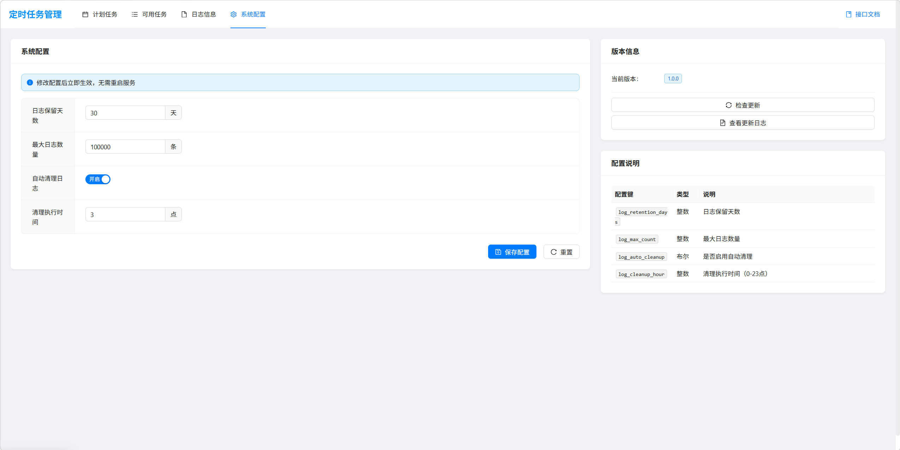

# 可视化定时任务管理系统

基于 Python FastAPI + APScheduler 构建的可视化定时任务管理平台，支持任务的创建、编辑、暂停、删除和实时状态监控。

此仓库仅包含后端代码，前端代码移步至 [前端代码仓库](https://github.com/mocehu/aps_dev_frontend)



## 功能特性

- 可视化界面操作，无需命令行
- 三种定时任务类型：cron、interval、date
- 支持秒级定时任务
- 任务搜索、暂停、编辑、删除
- 动态解析任务函数和参数
- 任务状态实时展示
- 执行日志追踪与查询

## 技术栈

| 组件 | 技术 |
|------|------|
| Web框架 | FastAPI |
| 任务调度 | APScheduler |
| 数据库 | PostgreSQL / SQLite |
| ORM | SQLAlchemy |
| 数据库迁移 | Alembic |
| 缓存 | Redis |

## 快速开始

### 环境要求

- Python 3.11+
- PostgreSQL 15+ (可选，默认使用 SQLite)
- Redis 7+ (可选)

（本项目未依赖底层或特殊功能，版本要求仅供参考，可适当当降低版本）

### 本地开发

1. **克隆项目**
```bash
git clone https://github.com/mocehu/python-apscheduler-visual.git
cd python-apscheduler-visual
```

2. **安装依赖**
```bash
pip install -r requirements.txt
```

3. **配置环境变量**
```bash
cp .env.example .env
# 编辑 .env 文件，根据需要修改配置
```

4. **启动服务**
```bash
python -m app.main
# 或
uvicorn app.main:app --reload
```

> 数据库会在首次启动时自动初始化，无需手动操作。

服务启动后访问：
- API文档: http://localhost:8000/docs
- ReDoc文档: http://localhost:8000/redoc

### Docker 部署

一键启动（包含 PostgreSQL 和 Redis）：

```bash
docker-compose up -d
```

仅启动应用（使用 SQLite）：

```bash
docker build -t scheduler-app .
docker run -d -p 8000:8000 scheduler-app
```

## 配置说明

### 环境变量

| 变量 | 说明 | 默认值 |
|------|------|--------|
| `DB_TYPE` | 数据库类型 (sqlite/postgresql) | sqlite |
| `POSTGRES_HOST` | PostgreSQL 主机 | localhost |
| `POSTGRES_PORT` | PostgreSQL 端口 | 5432 |
| `POSTGRES_USER` | PostgreSQL 用户名 | postgres |
| `POSTGRES_PASSWORD` | PostgreSQL 密码 | - |
| `POSTGRES_DB` | PostgreSQL 数据库名 | aps_dev |
| `REDIS_HOST` | Redis 主机 | localhost |
| `REDIS_PORT` | Redis 端口 | 6379 |
| `REDIS_PASSWORD` | Redis 密码 | - |
| `REDIS_DB` | Redis 数据库编号 | 0 |
| `HOST` | 服务监听地址 | 0.0.0.0 |
| `PORT` | 服务监听端口 | 8000 |
| `GITHUB_REPO` | GitHub 仓库地址 (格式: owner/repo) | - |
| `API_KEY_ENABLED` | 是否启用 API Key 认证 | true |
| `API_KEY` | API 密钥 | - |

> 日志清理相关配置现已支持前端动态配置，通过 API 接口管理，详见接口文档

## API 安全

### API Key 认证

系统默认启用 API Key 认证，所有 API 请求需携带正确的 `X-API-Key` 请求头。

**配置：**

```env
# .env
API_KEY_ENABLED=true
API_KEY=your-secret-key-here
```

**使用方式：**

```bash
# 请求示例
curl -H "X-API-Key: your-secret-key-here" http://localhost:8000/jobs/
```

```javascript
// 前端配置
fetch('/jobs/', {
    headers: { 'X-API-Key': 'your-secret-key-here' }
});

// 或全局配置
axios.defaults.headers.common['X-API-Key'] = 'your-secret-key-here';
```

**公开接口（无需认证）：**

| 接口 | 说明 |
|------|------|
| `/docs` | Swagger 文档 |
| `/redoc` | ReDoc 文档 |
| `/health` | 健康检查 |

**生成安全密钥：**

```bash
# 使用 openssl 生成随机密钥
openssl rand -hex 32
```

## 数据库管理

### 自动初始化

应用启动时会自动创建所需的数据库表，首次启动无需手动操作。

### 手动管理（可选）

手动初始化脚本用于特殊场景：

```bash
# 查看表状态
python scripts/init_db.py --status

# 重置数据库（危险操作，会删除所有数据）
python scripts/init_db.py --reset
```

### 数据库迁移

使用 Alembic 进行数据库版本管理：

```bash
# 创建迁移脚本
alembic revision --autogenerate -m "description"

# 应用迁移
alembic upgrade head

# 回退迁移
alembic downgrade -1
```


## 日志管理

### 自动清理

系统会根据配置自动清理过期日志：
- 删除超过保留天数的日志
- 当日志总数超过最大限制时删除最旧的日志

> 清理策略可通过 [系统配置](#系统配置) 动态调整，配置变更后立即生效。

### 手动管理

通过 API 接口手动管理日志：

```bash
# 查看日志统计
curl http://localhost:8000/log-stats/

# 清理过期日志
curl -X POST http://localhost:8000/cleanup-logs/

# 清除所有日志（危险操作）
curl -X POST http://localhost:8000/clear-logs/
```

### 内置任务

系统提供两个日志管理相关的内置任务：
- `auto_cleanup_logs` - 自动清理过期日志
- `get_logs_statistics` - 获取日志统计信息

可以通过创建定时任务来定制清理策略。

## 添加自定义任务

使用 `@task` 装饰器注册自定义任务：

```python
from app.services.tasks import task

@task(category="custom", description="自定义任务示例")
def my_custom_task(name: str, count: int = 1):
    """执行自定义操作"""
    for i in range(count):
        print(f"Hello {name}, iteration {i+1}")
    return f"完成 {count} 次迭代"
```

任务函数参数会自动解析并在可视化界面中展示。

## 项目结构

```
python-visual-task-scheduler/
├── app/                        # 应用主目录
│   ├── __init__.py
│   ├── main.py                 # 应用入口
│   ├── core/                   # 核心模块
│   │   ├── __init__.py
│   │   ├── conf.py             # 配置管理
│   │   └── database.py         # 数据库连接
│   ├── api/                    # API 路由
│   │   ├── __init__.py
│   │   └── routes.py           # API 路由定义
│   ├── models/                 # 数据模型
│   │   ├── __init__.py
│   │   ├── sql_model.py        # 数据库模型
│   │   └── schemas.py          # Pydantic 模型
│   └── services/               # 服务层
│       ├── __init__.py
│       ├── scheduler.py        # 任务调度核心
│       ├── tasks.py            # 任务函数注册
│       └── update_checker.py   # 更新检查服务
├── scripts/                    # 脚本
│   ├── init_db.py              # 数据库初始化脚本
│   └── migrate_jobs.py         # 任务迁移脚本
├── alembic/                    # 数据库迁移配置
│   ├── env.py
│   ├── script.py.mako
│   └── versions/
├── data/                       # SQLite 数据库存储
├── tests/                      # 测试目录
├── assets/                     # 文档图片
├── requirements.txt            # Python依赖
├── Dockerfile                  # Docker构建文件
├── docker-compose.yml          # Docker编排配置
├── alembic.ini                 # Alembic配置
├── .env.example                # 环境变量模板
└── README.md                   # 项目文档
```

## 常见问题

### 1. 数据库连接失败

检查 `.env` 中的数据库配置是否正确，确保 PostgreSQL 服务已启动。

### 2. 任务执行失败

查看执行日志 (`/logs/` 接口)，检查任务函数是否存在错误。

### 3. SQLite 数据库位置

默认存储在 `data/scheduler.db`，可在 `app/core/conf.py` 中修改路径。

## 许可证

MIT License